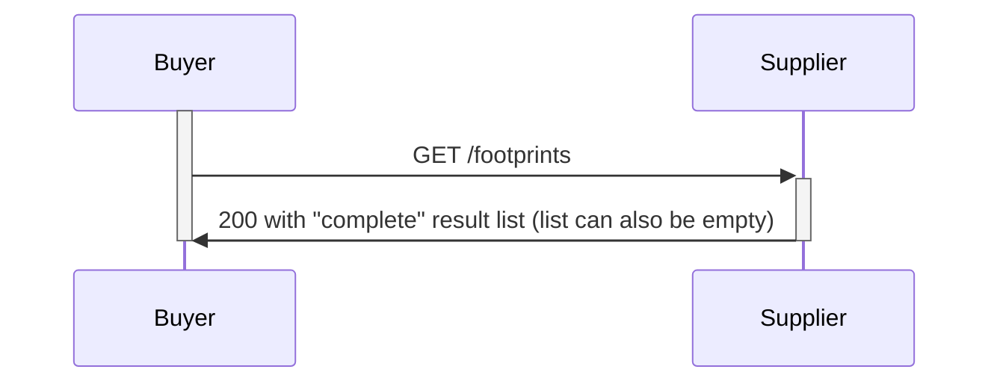
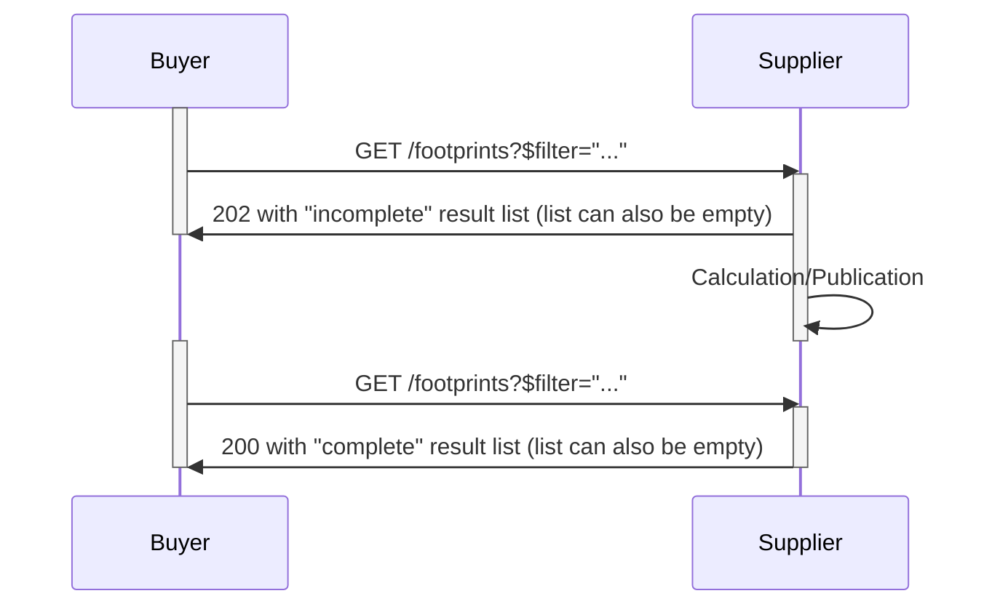

# 12. Request-Response Pattern Variants for wbcsd PACT

Date: 2022-11-22

## Status

Accepted

## Context

In version 1.0 a synchronous request/response pattern (https get) has been specified to retrieve pc/pcf data. The ListFootprints action is used to query the available data, and it's behavior is defined as the following:
1. For error scenarios, server (supplier) doesn't return a list and responds with an appropriate status code (4XX for client-side errors, like invalid $filter or 5XX for server-side errors).
2. In all other cases, the server is expected to return a list with http status 200. If there are no footprints matching the $filter or no matching data has been "published" for the client (buyer), the server responds with an empty list.

The specification v2.0 will introduce additional semantics for the ListFootprints action to allow the server (supplier) to return http status 202 "Accepted" when it principally decides that it can obtain more data in addition to what it returns as part of the request (like in the case 2 above).

This ADR does not cover the asynchronous put ("push") pattern, which is covered in ADR14 following the event pattern.

## Decision

Principle:
1.  The PCF request sent by the buyer stays as it is specified in v1.0. New optional filter parameters and operators will be supported by the endpoint to allow request of data for certain products. These are:
    1. Logical operators: `lt`, `gt`, `le`, `eq`, `and` (in addition to the existing `ge`).
    2. Lambda operator `any` on `companyIds` and `productIds` collection properties.
    3. Filter fields PF: `companyIds`, `productIds`, `productCategoryCpc` (in addition to the existing `created`, `updated`).
    4. Filter fields PCF: `geographyCountry`, `referencePeriodStart`, `referencePeriodEnd`.
2.  The supplier reacts in this context as follows:
    1. If the request generally cannot be responded, use one of the appropriate http client/server error status codes (4XX-5XX).
    2. If the request is valid and the response data is completely available, the server shall respond with http status 200 "OK" and a list of footprints.
    3. If the request is valid but the response data is not completely available yet (but principally the server decides it's able to obtain the remaining data), the server MAY respond with http 202 "Accepted" and the list of footprints as the incomplete result of the query (can also be empty). 
       1. This new status code indicates that: 
          1. The returned list is not the complete result of the query.
          2. The processing has started to obtain more data on the server (supplier) side.
       2. In order to get the complete result of the query (i.e. all requested footprints defined in $filter), the client should continue to retry the request (i.e. poll) with exponential backoff until it receives a response with http status 200 "OK".
       3. After the process of acquiring more data is completed on the server (supplier) side, it shall make this newly obtained data available like any other footprint it has, and it shall start returning status 200 "OK" to consecutive queries that are identical to the one that initiated the process.
       > **Note for future alignment**: A response header like [Retry-After](https://datatracker.ietf.org/doc/html/rfc9110#section-10.2.3) can be utilized to communicate estimated wait time for request fulfillment back to the Customer. Though, the header is designed to be used for scenarios where 503/3XX are returned.

#### Request Flow Examples
Http status 200 "OK" indicates the returned list is the complete result of the given query ($filter) 


Http status 202 "Accepted" indicates the returned list is an incomplete result of the given query ($filter), and the Buyer should continue to poll with the same $filter until it receives the complete result indicated with the http status 200 "OK".

#### $filter Examples
> **Note for future alignment**: Following examples are based on OData v4 standard (links: [ODatav4 $filter](http://docs.oasis-open.org/odata/odata/v4.0/errata03/os/complete/part2-url-conventions/odata-v4.0-errata03-os-part2-url-conventions-complete.html#_Toc453752358), [ODataV4 lambda operator example](https://learn.microsoft.com/en-us/azure/search/search-query-odata-collection-operators#examples)), which we followed in v1.0 for filtering. In some advanced cases (like filtering based on productIds collection property) it might be difficult to implement and parse on the server-side if done "manually". Therefore, as an alternative approach we might consider using a custom and simplified WBCSD syntax for filtering.

Get footprints with cpc code "3342"
```
productCategoryCpc eq '3342'
```

Get footprints for Germany
```
pcf/geographyCountry eq 'DE'
```

Get footprints for 2023 reporting period
```
(pcf/referencePeriodStart ge '2023-01-01T00:00:00.000Z') and (pcf/referencePeriodStart lt '2024-01-01T00:00:00.000Z') and (pcf/referencePeriodEnd ge '2023-01-01T00:00:00.000Z') and (pcf/referencePeriodEnd lt '2024-01-01T00:00:00.000Z')   
```

Get footprints for a specific product
```
productIds/any(pid:(pid eq 'urn:a'))
```

## Consequences

Solutions supporting v2 need to be aware that https 202 "Accepted" might be returned instead of 200 "OK" or error statuses. In such a case the client should retrieve the data later, which might be responded with 202 again (then the complete data is still not ready) or a 200 with a complete result set of pf/pcf in the response.
