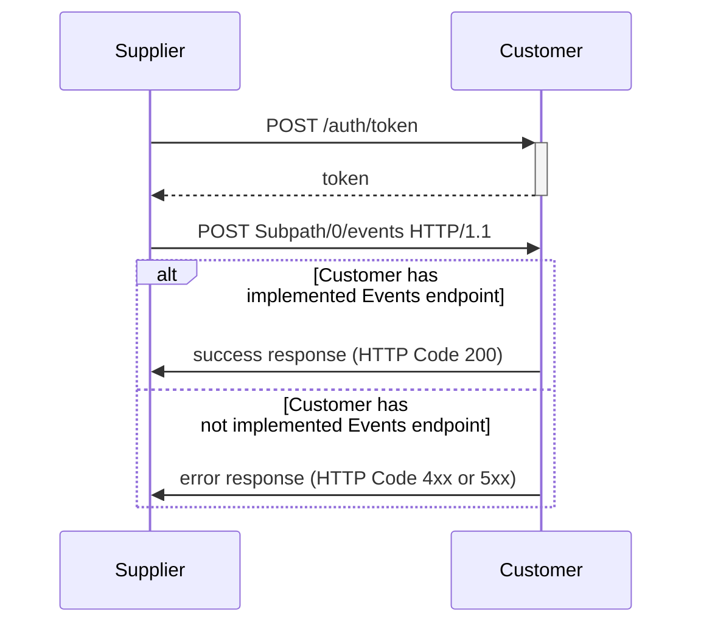
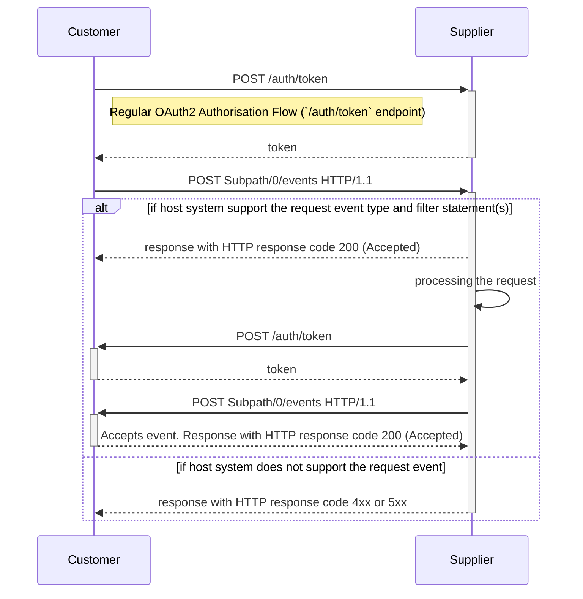

# 14. Event-based communication between Host Systems (Push based)

Date: 2022-10-31

## Status

Accepted

## Context

### Business Context
1. Notifying downstream Customers on Product Footprint (PF) updates (Push)

	Example:
	Suppliers will like to Push PF data updates to the downstream Customers without them requesting explicitly.

2. Requesting access to specific PF data (by a downstream Customer to upstream Suppliers) (Request) which otherwise is restricted / unavailable

	Example:
	Particular Product PF data is not available for the Customers when they initially request it i.e. Requesting a PF that is not exposed, yet. The Supplier would like to let the Customer know that there now is a result of this computation and the PF data can be available.


## Decision

1. Addition of an HTTP endpoint to exchange different kinds of Events between Host Systems
2. Specification of an Event and a Request/Response flow to notify downstream Customers on PF updates
    - Operating on top of the Events endpoint (Item #1)
3. Specification of Events and a Request/Response flow for requesting PF data from Supplier which was not available ealrier
    - Operating on top of the Events endpoint (Item #1)
4. Usage of JSON Event Data model from CloudEvents[^1] to encode aforementioned Events
   1. Usage of `Structured Content Mode` [^3] when exchanging events over HTTP


### Proposal

A new HTTP endpoint will be exposed to exchange Events between host systems. The endpoint shall be optional. 

If supported by a host system, this single events endpoint shall support

1. "directional" communcation, with a supplier sending an event to e.g. notify its customer of a PF update
2. "bi-directional" communcation, with a data recipient requesting a PF and a data owner asynchronously answering the request with error / success response

#### Syntax of the events endpoints:

```HTTP
POST $Subpath/0/events HTTP/1.1
Host: $Hostname
authorization: Bearer $BearerToken
content-type: application/cloudevents+json; charset=UTF-8
``` 
  
In case a host system does not implement the `/0/events` endpoint, it MUST respond with a HTTP error response (4xx, 5xx) and SHOULD respond with an ErrorResponse[^4] with code `Notimplemented`.

#### Specification of event flow: data owner notifying a data recipient of PF updates

In case a data owner wants to inform a data recipient about 1 or more product footprints being updated, the data owner POSTs a JSON object to above `/0/events` endpoint of a data recipient. 

The body must be a CloudEvents[^1] encoded JSON object as defined in CE-JSON-FORMAT[^2].

```json
{
  "type": "EventType",
  "specversion": "1.0",
  "id": "EventId",
  "source": "//OtherHostname/OtherSubPath",
  "time": "2022-05-31T17:31:00Z",
  "data": {
    "pfIds": [ ... ]
  }
}
```

| Property | Type | Description / Examplary Value |
| ----- | ------ | ----------- |
| type | String | Type of Event MUST be "org.wbcsd.pathfinder.ProductFootprint.Published.v1" 
| source | URI-reference | URI of the Host System (Supplier) e.g. "//OtherHostname/OtherSubPath"
| specversion | String  | The version of the CloudEvents specification which the event uses
| id | String | Event ID - Unique Identifier for a particular Event (for Audit / Logging etc.) e.g. 1234-4444-9999
| time | Timestamp | Timestamp when the transaction happened e.g. "2022-05-31T17:31:00Z"
| pfIds | Array | List of the product footprint identifier as per the Pathfinder network Data Model specification

The diagram below depicts the flow as mentioned above -

#### Request / Response flow (Supplier pushes PF Updates via Event)




#### Specification of event flow: data recipient making a product footprint request; data owner replying with success / error response

#### Overview




#### Details

In case a data recipient wants to request a product footprint from a data owner, the data recipient POSTs a JSON object to above `/0/events` endpoint. 

The body must be a CloudEvents[^1] encoded JSON object as defined in CE-JSON-FORMAT[^2] with properties `filters` and `sink` set.

Example request to the `/0/events` endpoint to request all PFs with UN CPC product category of `3342` (ethanol) with geography `FR` (France):

```json
{
  "type": "org.wbcsd.pathfinder.ProductFootprintRequest.Created.v1",
  "specversion": "1.0",
  "id": "EventId",
  "source": "//OtherHostname/OtherSubPath",
  "time": "2022-05-31T17:31:00Z",
  "data": {
      "productCategoryCpc": "3342",
      "pcf": {
        "geographyCountry": "FR"
      }
    }
}
```

The general syntax is:

```json
{
  "type": "org.wbcsd.pathfinder.ProductFootprintRequest.Created.v1",
  "specversion": "1.0",
  "id": "EventId",
  "source": "//OtherHostname/OtherSubPath",
  "time": "2022-05-31T17:31:00Z",
  "data": ProductFootprintFragment
}
```

with `ProductFootprintFragment` being a JSON object that MUST reference a subset of the `ProductFootprint` properties, **including nested properties**.

A host system MUST process such a request as follows:

1. a host system NOT supporting the request MUST respond the HTTP request with ErrorResponse detailing the reason for the error (i.e. with code `NotImplemented` in case this feature is not implemented)
2. a host system supporting the request MUST return a HTTP response code 200 (OK)
3. a host system then asynchronously processing the request

Processing the request is defined as

2. the host system performing a "partial match" of the `ProductFootprint` properties referenced in the `data` property of the filter
3. against the `ProductFootprint`s **accessible** to the requesting data recipient, such that
4. if a match is found, the `ProductFootprint` is returned to the requesting data recipient
5. with a match defined that all properties referenced in the `pf` property of the filter are present in the `ProductFootprint` and that the values of these properties are equal

##### Success response event

A host system upon successfully processing the request MUST send the response event to the host system referenced in `source` of the original request event.

The response event in case 0 or more ProductFootprints requested are ready:

```json
{
  "type": "org.wbcsd.pathfinder.ProductFootprintRequest.Fulfilled.v1",
  "specversion": "1.0",
  "id": "EventId",
  "source": "...",
  "data": {
    "requestEventId": "ReqEventId",
    "pfs": [ ... ]
  }
}
```

- with `ReqEventId` being the value of the `id` property of the request event.
- with `pfs` being an array of ProductFootprints as defined in the Pathfinder Data Model specification

If the host system has no ProductFootprints matching the request, it MUST still send a response event `pfs` set to the empty array.

If the host system of the original requestor (the data recipient) is not available or does not accept the response with a HTTP success code (2xx), the host system MUST retry sending the response event to the host system referenced in `source` of the original request event using exponential backoff.

A host system MUST NOT retry sending the response event for more than 3 days.

##### Error Response event

Similarly, the response event in the request cannot or will not be processed:

```json
{
  "type": "org.wbcsd.pathfinder.ProductFootprintRequest.Rejected.v1",
  "specversion": "1.0",
  "id": "EventId",
  "source": "...",
  "data": {
    "requestEventId": "ReqEventId",
    "error": { ... }
  }
}
```

- with `ErrorResponse` being an HTTP API Error Response as defined in [^4],
- with `ReqEventId` being the value of the `id` property of the request event.

The response event MUST be sent to the `sink` URI specified in the request event and with the same error strategy as defined for the success response event-case above.


## Consequences

1. Data owners can asynchronously notify downstream data recipients of PFC updates and downstream systems can asynchronously request PFCs from upstream systems at their own pace and discretion
2. Host systems implementing asynchronous PFC request functionality are responsible for
   1. implementing an event management system to keep track of such requests and to direct responses to the correct recipient
   2. implementing a retry strategy for sending responses to the recipient
   3. checking the `sink` URLs so credentials are **not** leaked


## References

[^1]: https://cloudevents.io/
[^2]: https://github.com/cloudevents/spec/blob/v1.0.2/cloudevents/formats/json-format.md
[^3]: https://github.com/cloudevents/spec/blob/v1.0.2/cloudevents/bindings/http-protocol-binding.md#32-structured-content-mode
[^4]: https://wbcsd.github.io/data-exchange-protocol/v2/#api-error-responses
[^5]: https://github.com/cloudevents/spec/blob/main/subscriptions/spec.md#324-filters
